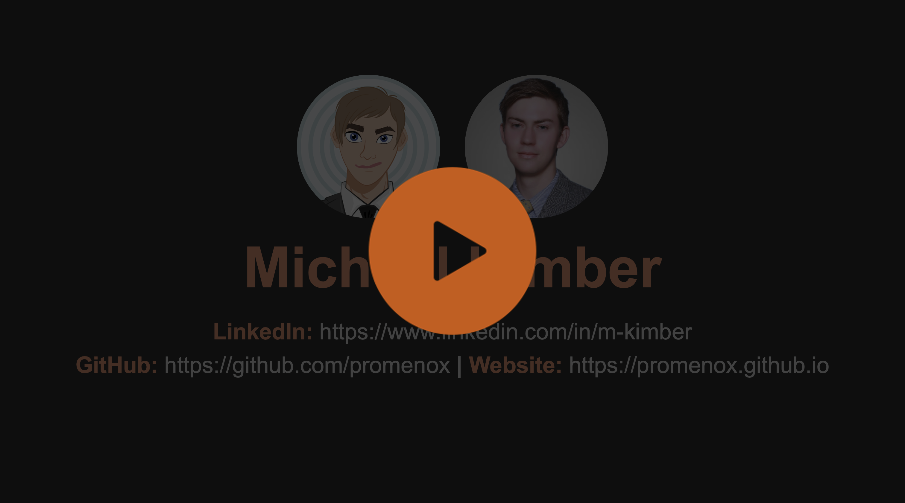

# Hi There! 👋
🚧 Under Construction 🚧 

  <!-- Dark Mode -->
  
  <!-- Light Mode -->
  

## Portfolio Video 🎬
I made this video to explaing my creative process. Click the cover image to watch the unlisted YouTube video, otherwise [click this link](https://youtu.be/W6GLbJJNRk0). 

👑🪄🐕 Doggo Fairy Magic. Enjoy.

<b>Vid Length: </b>1 min 55 sec
 

### Video Highlights
- Narrative Framework.
- MVP Build Style.
- Project Management.
- AI / ML / Programming (More Soon... 👷‍♂️)
- Proceduralism. 
- Math / Physics.
- Design Thinking.
- Stuff I Taught.

## Happening Now
I am implementing a [DSA playbook](https://docs.google.com/document/d/1bOqdAuzw33F0etx2T_SikiQQF-7Pi8Id_x5f5dGEZII/edit?usp=sharing) of learned patterns. Checkout the [repository](https://github.com/promenox/dsa-playbook).

<!--
Sub-pages will re-direct to elements showcased on homepage. 
-->

## Socials
- [LinkedIn](https://www.linkedin.com/in/m-kimber/)
- [Website](https://promenox.github.io/) (Work in progress... 👷‍♂️)

##
_* This page is under construction._ 🏗️ Last updated: 12/28/2025.
<!--
**promenox/promenox** is a ✨ _special_ ✨ repository because its `README.md` (this file) appears on your GitHub profile.

Here are some ideas to get you started:

- 🔭 I’m currently working on ...
- 🌱 I’m currently learning ...
- 👯 I’m looking to collaborate on ...
- 🤔 I’m looking for help with ...
- 💬 Ask me about ...
- 📫 How to reach me: ...
- 😄 Pronouns: ...
- ⚡ Fun fact: ...
-->

